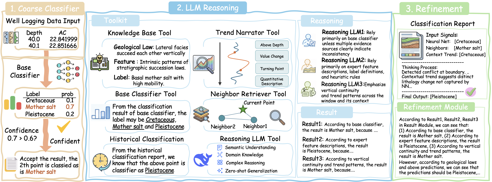

# GeoDecider: A Coarse-to-Fine Agentic Workflow for Explainable Lithology Classification

GeoDecider is a training-free, agentic reasoning framework designed for accurate and geologically consistent lithology classification from well-logging signals. By reformulating the classification task into an expert-like, multi-stage workflow, GeoDecider bridges the gap between efficient data-driven models and deep geological reasoning.

#### 🚀 Overview
Lithology classification is traditionally treated as a single-pass task, often leading to geologically implausible results. GeoDecider addresses this by using a coarse-to-fine pipeline:
1. Base Classifier-Guided Coarse Classification: A lightweight pre-trained model handles high-confidence samples to minimize computational costs.
2. Tool-Augmented LLM Reasoning: Low-confidence samples are routed to a reasoning module equipped with specialized tools (Knowledge Base, Trend Analysis, etc.).
3. Geological Refinement: A final post-processing stage enforces stratigraphic continuity and physical plausibility.

#### 🛠️ Core Components

1. Adaptive Inference Routing: Dynamically allocates computational resources by routing only ambiguous samples to high-cost LLM modules.

2. Specialized Toolset:
  Knowledge Base Tool: Grounding numerical data in geological semantics (e.g., physical meaning of logging curves).
  Contextual Trend Analysis: Summarizing signal evolution (stable, transition, boundary) across depth windows.
  Neighbor Retrieval: Providing empirical evidence from historical observations as reference cases.
  Historical Classification: Leveraging adjacent upper-interval predictions to ensure sequential coherence.

3. Multi-Persona Reasoning Ensemble: Decomposes the decision process into three perspectives: Data-Centric Analyst, Context-Aware Stratigrapher, and Rule-Based Physicist.
